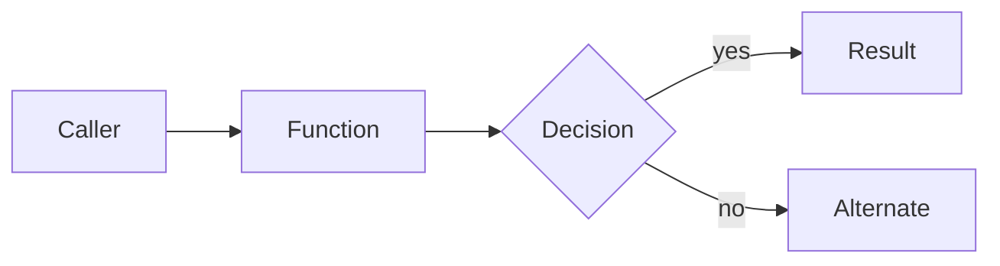

# [AI Review]

<!--
Sections above the `<details>` block are the at-a-glance reviewer view.
Audit detail goes inside the collapsible block at the bottom.
The `# [AI Review]` H1 above IS the marker — the n8n workflow recognises
the [AI Review] tag inside an H1 for upsert-by-marker. Do not add a
separate `[AI Review]` line above this heading.
-->

<!--
The two lines below MUST start with a literal emoji badge. Do NOT delete
the badge. Do NOT replace it with a blank. Substitute as follows:

  {RISK_BADGE}        Low → 🟢   Medium → 🟡   High → 🔴
  {CONFIDENCE_BADGE}  High → 🟢  Medium → 🟡   Low → 🔴   (inverted vs. Risk so 🟢 always means "good")

Worked examples (keep this exact shape, badge first, then bold label, then em-dash, then reason):
  🔴 **Risk: High** — touches auth and adds a DB migration
  🟢 **Confidence: High** — diff understood, tests reviewed, build verified
-->
{RISK_BADGE} **Risk: {RISK_LEVEL}** — {RISK_REASON}
{CONFIDENCE_BADGE} **Confidence: {CONFIDENCE_LEVEL}** — {CONFIDENCE_REASON}

## Decision
**{DECISION_SYMBOL} {DECISION_LABEL}**

**Why:** One-line rationale.

## Related
<!--
List linked references. Use the platform's NATIVE auto-link syntax — do
NOT wrap in markdown links, and do NOT append state, comment counts, or
"(title unavailable)" placeholders. The platform already shows that data
beneath the PR.

  - Azure DevOps work items:    `#<ItemId>`         (e.g. `#196182`)
  - Azure DevOps pull requests: `!<PullRequestId>`  (e.g. `!32147`)
  - GitHub issues / PRs:        `#<Number>`         (e.g. `#123`)

Optionally append ` — <Title>` only when the title genuinely helps a
reader scanning the comment. If the title is unavailable in context.json,
write just the bare reference — never invent one, never write
"(title unavailable)".

For references the platform does NOT auto-link (external wiki page,
ticket in another system, public docs URL), use a markdown link:
  `[Title](URL)`.

If there are no references, write a single line: `- (no linked items)`.
Never leave this section blank or with placeholder text.
-->
- (One bullet per reference. Native: `#<ItemId>` / `!<PullRequestId>` / `#<Number>`. External: `[Title](URL)`. No metadata.)

## Blockers
- (None — or short bullets of must-fix items. Reference Suggestion N for the fix.)

## Suggestions

<!--
`Source:` is required ONLY when the suggestion relies on external material
(project docs, inline comments, linked work items, public docs). Cite the
path with line range, or the URL. Omit the line entirely for findings
derived purely from the diff. Examples:
  Source: .github/copilot-instructions.md
  Source: src/Foo.cs:42-48 (comment)
  Source: #196182
-->

#### Suggestion 1 · 🔴 Blocking

File:
Line range:

Reason:
Source:

```suggestion

```

#### Suggestion 2 · 🟡 Recommended

File:
Line range:

Reason:
Source:

```suggestion

```

#### Suggestion 3 · ⚪ Optional

File:
Line range:

Reason:
Source:

```suggestion

```

## How it works

Plain-English explanation of what this PR achieves for users / the business. Pull from the linked work item, PR title, commit messages, and code structure. If the source material is sparse, end this section with: _(Inferred from diff; verify intent.)_

Add a Mermaid diagram when a flow / sequence / architecture sketch helps:



> Generated images are off by default. Set `GenerateImages: true` in `pr-review.json` to allow one image per PR when the AI judges that a real picture (mockup, before/after, conceptual sketch) would meaningfully help. Mermaid is always allowed.

## How to test

1. Copy-pasteable steps a reviewer can run in under 5 minutes.
2. Test commands, e.g. `dotnet test --filter "FullyQualifiedName~Specific.Tests"`.
3. Manual UI walkthrough when applicable.

## Files to review first

- `path/to/highest-risk-file.ext` — why this file matters
- `path/to/next.ext` — why
- `path/to/third.ext` — why

<details>
<summary><strong>Audit Details...</strong></summary>

## Context
- PR: {PR_LINK}
- Work Item: {WORK_ITEM_LINK}
- Repo: {REPO_NAME} ({PROJECT_NAME})
- Base branch: {BASE_BRANCH}
- Feature branch: {FEATURE_BRANCH}

## Scope
- Files changed count:
- Key areas (modules/services/paths):
- Notable additions:
- Notable removals:
- Renames and migrations:

## Strengths
- Clear improvements or refactors:
- Better separation of concerns or reduced complexity:
- Adherence to coding conventions:

## Issues and risks
- Potential correctness issues:
- Breaking changes or backward compatibility concerns:
- Edge cases not covered:
- Observability/monitoring gaps:

## Testing
- Existing tests affected:
- New tests added:
- Coverage adequacy for risk level:
- Manual validation steps required:
- Recommended durable tests (when automated coverage is missing):

## Security
- Secrets and credentials posture:
- Input validation and output encoding:
- Authorization checks at boundaries:
- Dependency changes and known CVEs (if any):

## Performance
- Hot paths affected:
- Complexity and algorithmic considerations:
- I/O and data access patterns:
- Caching or batching opportunities:

## Operations
- Migrations and reversibility:
- Configuration and feature flags:
- Logging/metrics/tracing changes:
- Rollout plan or canary considerations:

## Documentation
- README or service docs updates required:
- Changelog entry:
- Inline code comments quality:

## Diff overview
- See `{WorkFolder}/all-pre-content.txt`, `all-post-content.txt`, `all-diffs.txt`.

</details>
