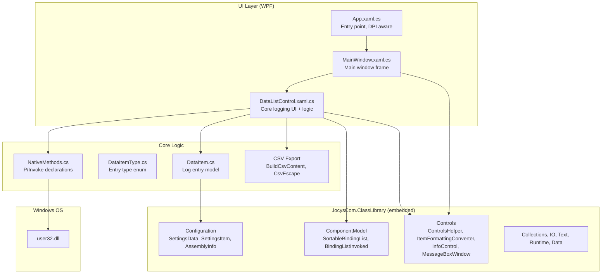
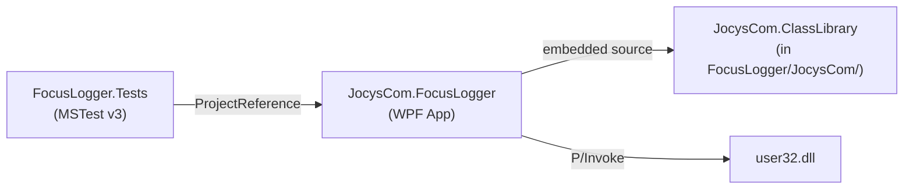

# Repository Analysis

## 1. Repository Overview

This document provides a factual reference for the Jocys.com FocusLogger repository, aimed at developers and AI coding agents working on the codebase.

**FocusLogger** is a Windows desktop utility that monitors and logs which process or program takes window focus. It targets users (especially gamers and power users) who experience unexpected focus stealing — where a background process briefly grabs foreground focus, interrupting gameplay or work. The tool logs every focus change with timestamps, process details, window class names, and focus-state flags, allowing users to identify the culprit.

- **Repository:** https://github.com/JocysCom/FocusLogger
- **License:** GNU General Public License v3.0
- **Current version:** 1.2.6
- **Target platform:** Windows 7 SP1+ with .NET 8.0
- **Primary audiences:** Gamers, power users, IT support personnel diagnosing focus-stealing issues.

## 2. Top-Level Structure

This section maps every top-level directory and file to help navigate the repository quickly.

| Path | Purpose |
|------|---------|
| `FocusLogger/` | Main application project (WPF, .NET 8.0). Contains all app source code, shared library, and resources. |
| `FocusLogger.Tests/` | MSTest test project. Unit tests for CSV export and UI automation tests. |
| `Documents/` | Release engineering: signing scripts, zip packaging scripts, screenshot tooling, and pre-built release files. |
| `Resources/` | Solution-level shared scripts (currently `ZipFiles.ps1` for checksum-aware zip packaging). |
| `.ai/` | AI agent instructions and repository analysis (this file). |
| `JocysCom.FocusLogger.slnx` | Solution file (XML-based `.slnx` format) referencing the two projects. |
| `README.md` | Project overview, download link, system requirements, screenshot. |
| `LICENSE` | GPLv3 license text. |
| `SECURITY.md` | Security vulnerability reporting policy (support@jocys.com). |
| `Settings.XamlStyler` | XamlStyler configuration for consistent XAML formatting. |
| `Solution_Cleanup.ps1` | PowerShell script for cleaning build artifacts. |

## 3. Technology Stack & Key Dependencies

This section lists verified technologies and versions drawn from project files.

| Technology | Version / Detail | Evidence |
|------------|-----------------|----------|
| .NET | 8.0 (`net8.0-windows`) | `JocysCom.FocusLogger.csproj` TargetFramework |
| C# | Implicit (SDK default for .NET 8) | SDK-style project |
| WPF | `<UseWPF>true</UseWPF>` | csproj |
| Windows Forms interop | `<UseWindowsForms>true</UseWindowsForms>` | csproj — used for P/Invoke helpers and DPI awareness |
| MSTest | v3.x (`MSTest.TestFramework 3.*`, `MSTest.TestAdapter 3.*`) | Test csproj PackageReference |
| Microsoft.NET.Test.Sdk | 17.x | Test csproj PackageReference |
| Windows API (user32.dll) | P/Invoke | `NativeMethods.cs` |
| PowerShell | Scripts for build, sign, zip, cleanup | `Documents/`, `Resources/`, root |
| XamlStyler | Config present | `Settings.XamlStyler` |

**No NuGet package dependencies** in the main application project — all functionality comes from .NET SDK and the embedded `JocysCom.ClassLibrary`.

## 4. Architecture & Runtime Model

This section describes how the application is structured and how it operates at runtime.

FocusLogger is a **single-executable WPF desktop application** that polls Windows API functions to detect focus changes. It does not persist log data between sessions (in-memory only) but provides CSV export for offline analysis.

### Architectural layers



### Key architectural decisions

- **Polling via timer:** A `System.Timers.Timer` with 1ms interval (non-auto-reset) continuously polls `GetActiveWindow()` and `GetForegroundWindow()`. Duplicate events are suppressed via `DataItem.IsSame()`.
- **Thread safety:** Timer fires on a thread-pool thread; UI updates are marshalled via `ControlsHelper.BeginInvoke()`. A `lock(AddLock)` synchronizes the polling logic.
- **Embedded shared library:** `JocysCom.ClassLibrary` files are included directly in `FocusLogger/JocysCom/` rather than as a compiled DLL or NuGet package.
- **No MVVM framework:** Code-behind pattern with data binding. `DataListControl.xaml.cs` contains both view-model-like logic and model interaction.

## 5. Project Inventory

This section lists each project in the solution with its key metadata.

### 5.1 JocysCom.FocusLogger (main application)

| Property | Value |
|----------|-------|
| Path | `FocusLogger/JocysCom.FocusLogger.csproj` |
| Output type | `WinExe` |
| Target framework | `net8.0-windows` |
| Assembly name | `JocysCom.FocusLogger` |
| Description | Find out which process or program is taking the window focus. In game, mouse and keyboard could temporarily stop responding if another program takes the focus. This tool could help diagnose which program is stealing the focus. |
| Version | 1.2.6 |
| NuGet dependencies | None |
| Embedded resources | `Resources/BuildDate.txt` (auto-generated), `Resources/AiAnalysisPrompt.md` |

**Source structure:**

| Directory | Contents |
|-----------|----------|
| `FocusLogger/` (root) | `App.xaml(.cs)`, `MainWindow.xaml(.cs)`, `AssemblyInfo.cs`, `App.ico` |
| `FocusLogger/Common/` | `DataItem.cs`, `DataItemType.cs`, `NativeMethods.cs` |
| `FocusLogger/Controls/` | `DataListControl.xaml(.cs)` — core logging control |
| `FocusLogger/JocysCom/` | Embedded `JocysCom.ClassLibrary` (~30 files across Collections, Common, ComponentModel, Configuration, Controls, Data, IO, Runtime, Text) |
| `FocusLogger/Resources/` | `AiAnalysisPrompt.md`, `BuildDate.txt`, `Icons/` (SVG sources, XAML icons, conversion scripts) |
| `FocusLogger/Properties/` | Publish profiles |

### 5.2 JocysCom.FocusLogger.Tests (test project)

| Property | Value |
|----------|-------|
| Path | `FocusLogger.Tests/JocysCom.FocusLogger.Tests.csproj` |
| Target framework | `net8.0-windows` |
| Test framework | MSTest v3.x |
| Project reference | `FocusLogger/JocysCom.FocusLogger.csproj` |

**Test files:**

| File | Purpose |
|------|---------|
| `CsvExportTests.cs` | Unit tests for `CsvEscape` and `BuildCsvContent` methods |
| `UIAutomationTests.cs` | UI automation tests using `System.Windows.Automation` — launches the built app and interacts with controls by AutomationId |

Run tests with: `dotnet test FocusLogger.Tests/JocysCom.FocusLogger.Tests.csproj`

## 6. Dependency & Data Flow

This section explains how the projects and components relate to each other and how data moves through the system.

### Project dependency graph



### Runtime data flow

1. `System.Timers.Timer` fires (1ms interval, non-auto-reset).
2. `DataListControl.UpdateInfo()` acquires `AddLock`.
3. Calls `NativeMethods.GetActiveWindow()` and `NativeMethods.GetForegroundWindow()`.
4. For each handle, `GetItemFromHandle()` creates a `DataItem` with timestamp, focus flags (mouse/keyboard/caret), window title, and window class name.
5. `IsSame()` checks if the event differs from the previous one; if not, it is skipped.
6. `UpdateFromProcess()` enriches the `DataItem` with process name and path (with error handling for restricted processes).
7. The item is inserted at position 0 of `SortableBindingList<DataItem>` via `ControlsHelper.BeginInvoke()` (UI thread dispatch).
8. The WPF `DataGrid` updates via data binding. `ItemFormattingConverter` translates boolean flags to icons.

### CSV export flow

1. User clicks "Save CSV" button.
2. `SaveFileDialog` prompts for file location.
3. `BuildCsvContent()` iterates all `DataItem` entries, writing CSV with headers: Date, PID, Process Name, Active, Mouse, Keyboard, Caret, Window Title, Window Class, Path.
4. File is written as UTF-8.
5. "Explore" button opens the saved file location in Explorer.
6. "AI Prompt Example" button shows the embedded `AiAnalysisPrompt.md` in a `MessageBoxWindow` for users to copy and paste into an AI assistant along with their CSV.

## 7. Build, Test, CI/CD & Operational Workflows

This section documents how the project is built, tested, and released based on repository evidence.

### Build

```bash
dotnet build JocysCom.FocusLogger.slnx
```

- **Pre-build event:** Generates `Resources/BuildDate.txt` with the current ISO 8601 timestamp via PowerShell.
- **Output:** Single `JocysCom.FocusLogger.exe` in `bin/{Configuration}/net8.0-windows/`.
- **Debug configuration:** Embedded PDB symbols (`DebugType: embedded`).

### Test

```bash
dotnet test FocusLogger.Tests/JocysCom.FocusLogger.Tests.csproj
```

- **Framework:** MSTest v3.x with Microsoft.NET.Test.Sdk 17.x.
- **Unit tests:** `CsvExportTests` — validates CSV escaping and content generation.
- **UI automation tests:** `UIAutomationTests` — launches the built application and interacts via `System.Windows.Automation`. Requires a prior build of the main project.

### Release / packaging scripts

| Script | Purpose |
|--------|---------|
| `Documents/App_1_Sign.ps1` | Code-signs the application executable. |
| `Documents/App_2_Zip.ps1` | Packages the signed executable into a release ZIP. |
| `Resources/ZipFiles.ps1` | Shared utility for checksum-aware ZIP creation (compares source/dest checksums before rebuilding). |
| `Documents/Take_Screenshot.ps1` | Captures application screenshot for documentation. |
| `Solution_Cleanup.ps1` | Cleans `bin/`, `obj/`, and other build artifacts. |

### Icon workflow

SVG icon sources are stored in `FocusLogger/Resources/Icons/Icons_Default/`. The script `Convert_SVG_to_XAML.ps1` converts them to XAML resource dictionaries (`Icons_Default.xaml`).

### CI/CD

No CI/CD workflow files were found under `.github/workflows/`. Builds and releases appear to be performed locally.

## 8. Documentation Map

This section identifies where documentation lives in the repository.

| Location | Audience | Content |
|----------|----------|---------|
| `README.md` | End users, contributors | Project overview, download link, system requirements, screenshot |
| `SECURITY.md` | Security researchers | Vulnerability reporting policy |
| `LICENSE` | All | GPLv3 full text |
| `.ai/instructions.md` | AI agents | Coding style guidelines for AI-assisted edits |
| `.ai/repository-analysis.instructions.md` | AI agents, developers | This file — comprehensive repository reference |
| `FocusLogger/Resources/AiAnalysisPrompt.md` | End users | Prompt template for users to paste into AI assistants alongside exported CSV logs |
| `Documents/Images/` | README, users | Application screenshot |
| `Settings.XamlStyler` | Developers | XamlStyler formatting configuration |

## 9. AI-Agent-Relevant Conventions and Constraints

This section captures rules and patterns that materially affect automated edits.

1. **Coding style:** Follow Microsoft C# conventions. PascalCase for public members, camelCase for locals. Some private fields use `_PascalCase` (e.g., `_Date`). Preserve existing naming patterns in each file.

2. **Doc comments:** Per `.ai/instructions.md`, convert simple comments to XML documentation comments where beneficial for IntelliSense. Do not alter surrounding code when doing so.

3. **Shared library files (`FocusLogger/JocysCom/`):** These are embedded from a shared `JocysCom.ClassLibrary`. Exercise caution when editing — changes here may diverge from the upstream library.

4. **XAML formatting:** The repository uses XamlStyler (see `Settings.XamlStyler`). XAML edits should conform to the configured style.

5. **No NuGet packages in the main app:** All dependencies are framework-provided or embedded source. Do not introduce NuGet package dependencies without explicit approval.

6. **Test project uses MSTest v3:** New tests should follow MSTest v3 patterns (`[TestClass]`, `[TestMethod]`, `Assert.*`).

7. **UI automation tests depend on a built executable:** `UIAutomationTests` locate the app at a relative path from the test output. Building the main project before running these tests is required.

8. **Pre-build event:** The csproj generates `Resources/BuildDate.txt` via PowerShell. This file should not be manually edited or committed.

9. **Solution format:** Uses `.slnx` (XML-based solution format), not the older `.sln` text format.

10. **No CI/CD pipelines:** All build and release steps are manual/local. Scripts in `Documents/` handle signing and packaging.
