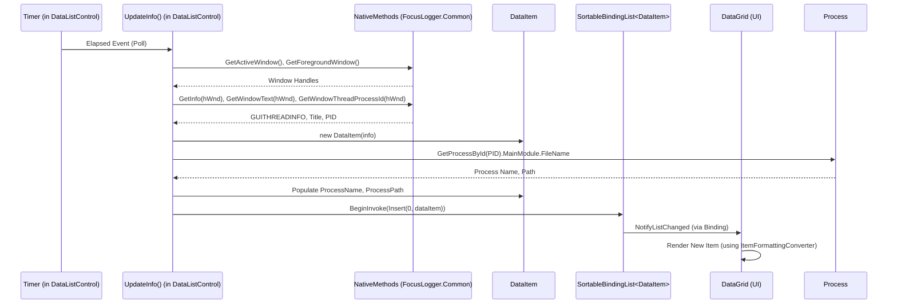
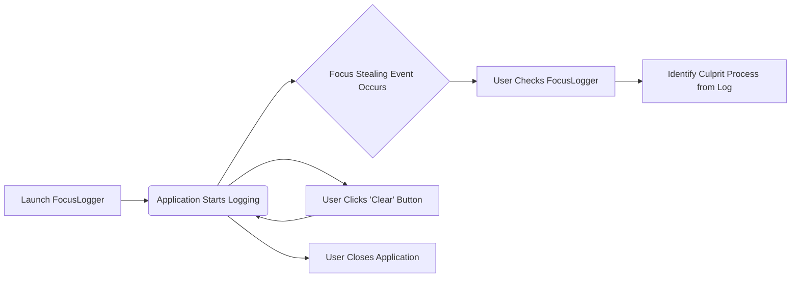

# FocusLogger Repository Analysis

This document provides a comprehensive analysis of the Jocys.com FocusLogger repository from the perspectives of a Software Architect, Software Developer, and Product Manager.

## 1. Software Architect Analysis

### 1.1. Overall Architecture

FocusLogger is a desktop application for Microsoft Windows (7 SP1+), built using **.NET 6.0**. The primary UI framework is **Windows Presentation Foundation (WPF)**, with evidence of **Windows Forms** interoperability (`UseWindowsForms` is true in the `.csproj`), mainly for P/Invoke calls and potentially some low-level system interactions (like DPI awareness setup).

The application follows a fairly traditional structure for a utility tool:
*   **Single Executable (`WinExe`):** All functionality is compiled into a single `.exe`.
*   **Event-Driven:** The core logic revolves around monitoring system events (window focus changes) using a timer-based polling mechanism that calls Windows API functions.
*   **UI Layer:** WPF is used for the user interface, with XAML defining the layout and C# for the code-behind.
*   **Core Logic Layer:** C# classes handle data acquisition (via P/Invoke), data processing, and managing the collection of logged events.
*   **Shared Library (`JocysCom.ClassLibrary`):** The application heavily relies on a comprehensive shared library, parts of which are embedded directly into the `FocusLogger/JocysCom/` directory. This library provides common functionalities for configuration, component model (data binding, collections), UI controls, and other utilities. The use of `MakeLinks.ps1` suggests these shared components might be hard-linked from a central repository.

A simplified architectural diagram:

```mermaid
graph TD
    subgraph UserSystem [User's Windows System]
        direction LR
        WinAPI[Windows API (user32.dll)]
    end

    subgraph FocusLoggerApp [FocusLogger Application (.NET 6 WPF)]
        direction TB
        AppCs[App.xaml.cs (Entry Point, DPI Aware)] --> MainWin[MainWindow.xaml.cs (Main UI Frame)]
        MainWin --> DataListCtrl[DataListControl.xaml.cs (Core Logic & Display)]
        DataListCtrl -- Polls & Displays --> LogData[SortableBindingList<DataItem> (In-Memory Log)]
        DataListCtrl -- Uses --> NativeMethodsApp[FocusLogger.Common.NativeMethods.cs (P/Invoke for Focus)]
        NativeMethodsApp -- Calls --> WinAPI

        subgraph SharedLib [JocysCom.ClassLibrary (Embedded in FocusLogger/JocysCom/)]
            direction TB
            SettingsMgmt[Configuration (SettingsData, AssemblyInfo)]
            ComponentModel[ComponentModel (NotifyPropertyChanged, SortableBindingList)]
            ControlsLib[Controls (ControlsHelper, InfoControl, ItemFormattingConverter)]
            OtherUtils[Other Utilities (IO, Text, etc.)]
        end

        AppCs -- Uses Resources --> ControlsLib
        MainWin -- Uses --> ControlsLib
        MainWin -- Uses --> SettingsMgmt
        DataListCtrl -- Uses --> ComponentModel
        DataListCtrl -- Uses --> ControlsLib
        LogData -- Composed of --> DataItem[FocusLogger.Common.DataItem.cs (Log Entry Model)]
        DataItem -- Inherits from --> SettingsMgmtBase[SettingsItem (from JocysCom.Configuration)]

    end

    style FocusLoggerApp fill:#f9f,stroke:#333,stroke-width:2px
    style SharedLib fill:#ccf,stroke:#333,stroke-width:1px
    style UserSystem fill:#eee,stroke:#333,stroke-width:1px
```

### 1.2. Key Components & Modules

1.  **Application Core (`FocusLogger/App.xaml.cs`, `FocusLogger/AssemblyInfo.cs`):**
    *   Responsibilities: Application entry point, initialization (DPI awareness), global resource loading (themes, icons).
    *   Key Files: `App.xaml`, `App.xaml.cs`.

2.  **Main User Interface (`FocusLogger/MainWindow.xaml.cs`):**
    *   Responsibilities: Provides the main window frame, hosts the primary controls. Initializes UI helper contexts.
    *   Key Files: `MainWindow.xaml`, `MainWindow.xaml.cs`.
    *   Uses `JocysCom.ClassLibrary.Controls.InfoControl` for an information panel.

3.  **Focus Logging & Display (`FocusLogger/Controls/DataListControl.xaml.cs`):**
    *   Responsibilities: This is the engine of the application.
        *   Periodically polls for active and foreground window changes using a `System.Timers.Timer`.
        *   Retrieves window and process information using P/Invoke calls.
        *   Populates `DataItem` objects with the collected data.
        *   Manages a `SortableBindingList<DataItem>` to store log entries.
        *   Displays log entries in a `DataGrid`.
        *   Handles UI updates in a thread-safe manner using `ControlsHelper.BeginInvoke`.
        *   Provides a "Clear" functionality for the log.
    *   Key Files: `DataListControl.xaml`, `DataListControl.xaml.cs`.

4.  **Data Model (`FocusLogger/Common/DataItem.cs`):**
    *   Responsibilities: Defines the structure for a single log entry, including timestamp, process information, window title, and focus state (active, mouse, keyboard, caret).
    *   Inherits from `JocysCom.ClassLibrary.Configuration.SettingsItem` for `INotifyPropertyChanged` support.
    *   Key Files: `DataItem.cs`.

5.  **Native Windows API Interaction (`FocusLogger/Common/NativeMethods.cs`):**
    *   Responsibilities: Encapsulates all P/Invoke declarations and helper methods for interacting with `user32.dll` functions (e.g., `GetForegroundWindow`, `GetActiveWindow`, `GetGUIThreadInfo`, `GetWindowText`, `GetWindowThreadProcessId`).
    *   Key Files: `NativeMethods.cs`.

6.  **Shared Library (`FocusLogger/JocysCom/` - representing `JocysCom.ClassLibrary`):**
    *   **Configuration (`FocusLogger/JocysCom/Configuration/`):**
        *   Provides robust settings management (`SettingsData<T>`, `SettingsItem`, `SettingsHelper`). Includes serialization, compression, file monitoring, and checksums.
        *   `AssemblyInfo` class for retrieving application metadata.
        *   Used by `DataItem` (inherits `SettingsItem`) and `MainWindow` (for title).
    *   **ComponentModel (`FocusLogger/JocysCom/ComponentModel/`):**
        *   `NotifyPropertyChanged`: Base class for `INotifyPropertyChanged`.
        *   `BindingListInvoked<T>`: Thread-safe `BindingList<T>`.
        *   `SortableBindingList<T>`: Extends `BindingListInvoked<T>` with sorting (`IBindingListView`) and item change notification capabilities. Used for `DataItems` in `DataListControl`.
        *   `PropertyComparer<T>`: Used for custom sorting.
    *   **Controls (`FocusLogger/JocysCom/Controls/`):**
        *   `ControlsHelper`: Provides utility functions for controls, including `InitInvokeContext` (for UI thread marshalling), `BeginInvoke`, and `IsDesignMode`.
        *   `ItemFormattingConverter`: A versatile `IMultiValueConverter` used in `DataListControl` for complex cell formatting.
        *   `InfoControl`: A reusable WPF control for displaying information (used in `MainWindow`).
        *   Theme and Icon resources (`Themes/Default.xaml`, `Themes/Icons.xaml`).
    *   Other modules like `IO`, `Text`, `Runtime`, `Collections`, `Data` provide further utilities.

### 1.3. Dependencies

*   **Internal:**
    *   `FocusLogger` (main app) depends heavily on `JocysCom.ClassLibrary` (embedded).
    *   `DataListControl` depends on `FocusLogger.Common.NativeMethods` and `FocusLogger.Common.DataItem`.
    *   `DataItem` depends on `JocysCom.ClassLibrary.Configuration.SettingsItem`.
*   **External:**
    *   .NET 6.0 SDK (WPF, Windows Forms support).
    *   Windows API (`user32.dll`).

### 1.4. Data Management

*   **Primary Data:** The log of focus events, stored in-memory as a `SortableBindingList<DataItem>` within `DataListControl`.
*   **Data Model:** `DataItem.cs` defines the schema for each log entry.
*   **Persistence:** The application, as analyzed, does not appear to persist the focus log itself between sessions. The `SettingsData<T>` infrastructure from `JocysCom.ClassLibrary` is present and `DataItem` inherits `SettingsItem`, so the capability to save/load these items exists, but it's not explicitly used for the log in `DataListControl`. It might be used for application settings if any were defined (none obvious in the current scope).
*   **Data Flow:**
    1.  Timer in `DataListControl` fires.
    2.  `UpdateInfo()` calls `NativeMethods` to get window handles and `GUITHREADINFO`.
    3.  `GetItemFromHandle()` creates a `DataItem` and populates it.
    4.  `UpdateFromProcess()` enriches `DataItem` with process name and path.
    5.  `DataItem` is added to `DataItems` list via `ControlsHelper.BeginInvoke`.
    6.  `DataGrid` in `DataListControl.xaml` (bound to `DataItems`) updates, using `ItemFormattingConverter` for display.



### 1.5. Configuration

*   Application configuration (e.g., user preferences) doesn't seem to be a prominent feature based on the core logging functionality.
*   However, the `JocysCom.ClassLibrary.Configuration` module provides extensive capabilities for this if needed.
*   The application title is configured dynamically using `JocysCom.ClassLibrary.Configuration.AssemblyInfo`.
*   Build date is embedded as a resource (`Resources/BuildDate.txt`) via a pre-build event in the `.csproj` file.

### 1.6. Cross-cutting Concerns

*   **Error Handling:**
    *   Present in `DataListControl.UpdateFromProcess()` when accessing process information (e.g., `MainModule.FileName` can throw exceptions for restricted processes). It catches exceptions, sets `DataItem.NonPath = true`, and provides informative error messages, including a hint to "Run as Administrator" for access denied errors.
    *   The P/Invoke calls in `NativeMethods` generally don't show explicit `SetLastError=true` and `Marshal.GetLastWin32Error()` handling, but some API calls might return error codes or null pointers which are checked (e.g., `GetGUIThreadInfo` result).
*   **Logging (Meta):** The application *is* a logger. It doesn't seem to have its own internal diagnostic logging system beyond what's presented to the user.
*   **Threading & Concurrency:**
    *   A `System.Timers.Timer` is used for polling, which operates on a separate thread.
    *   UI updates from the timer's elapsed event are marshalled to the UI thread using `ControlsHelper.BeginInvoke()`.
    *   `BindingListInvoked<T>` (base for `SortableBindingList<T>`) is designed to raise `ListChanged` events on the UI thread.
    *   An `AddLock` object (`lock (AddLock)`) is used in `UpdateInfo()` to synchronize access when checking old/new items and preparing to add to the `DataItems` collection.
*   **DPI Awareness:** Explicitly handled in `App.xaml.cs` by calling `SetProcessDPIAware()`.
*   **Resource Management:** Standard WPF resource dictionaries are used for themes and icons.

## 2. Software Developer Analysis

### 2.1. Coding Conventions & Patterns

*   **Naming Conventions:** Generally follows Microsoft C# naming conventions (PascalCase for classes, methods, properties; camelCase for local variables and private fields, though some private fields like `_Date` use PascalCase with an underscore prefix).
*   **Code Structure:**
    *   Well-organized into namespaces (`JocysCom.FocusLogger`, `JocysCom.FocusLogger.Controls`, `JocysCom.FocusLogger.Common`).
    *   The `JocysCom.ClassLibrary` components are also well-structured into namespaces like `JocysCom.ClassLibrary.Configuration`, `JocysCom.ClassLibrary.ComponentModel`, etc.
    *   Use of `partial class` for XAML code-behind and potentially for extending classes like `AssemblyInfo`.
*   **P/Invoke:** Neatly encapsulated within `NativeMethods` classes (one in `FocusLogger.Common` for app-specific needs, one in `App.xaml.cs` for DPI, and likely others within `JocysCom.ClassLibrary` like in `AssemblyInfo.cs`).
*   **WPF Usage:**
    *   MVVM (Model-View-ViewModel) is not strictly followed. The code-behind (`DataListControl.xaml.cs`) contains significant logic (View-Model like responsibilities and even Model interaction). This is common for smaller utilities.
    *   Data binding is used extensively in `DataListControl.xaml` to bind `DataGrid` columns to `DataItem` properties.
    *   `INotifyPropertyChanged` is implemented in `JocysCom.ClassLibrary.ComponentModel.NotifyPropertyChanged` and used by `SettingsItem` and thus `DataItem`.
    *   Use of `IMultiValueConverter` (`ItemFormattingConverter`) for complex cell display logic.
    *   Resource Dictionaries for styling and icons.
*   **Error Handling:** `try-catch` blocks are used in critical sections like process information retrieval.
*   **Comments:** Good use of XML documentation comments for P/Invoke methods in `NativeMethods.cs`. Other comments explain specific logic (e.g., DPI awareness).
*   **Thread Safety:** Explicit `lock` statements and UI thread invocation (`BeginInvoke`) show awareness of threading issues.

### 2.2. Core Logic Implementation

*   **Focus Detection Loop (`DataListControl.UpdateInfo`):**
    *   The core logic relies on a high-frequency timer (1ms interval, though effective polling rate will be slower due to work done).
    *   It polls both `GetActiveWindow()` and `GetForegroundWindow()`. The distinction is subtle: `GetActiveWindow` is tied to the calling thread's message queue, while `GetForegroundWindow` is system-wide. Logging both might be for thoroughness or to catch specific edge cases.
    *   `DataItem.IsSame()` is used to avoid logging redundant entries if only minor properties (like window title) change but the core focus state (PID, focus flags) remains the same for the *same type* of event (active vs. foreground).
    *   `GetItemFromHandle()` is a key helper that uses `NativeMethods.GetInfo()` (which wraps `GetGUIThreadInfo`) to determine `HasMouse`, `HasKeyboard`, `HasCaret` states.
*   **Process Information (`DataListControl.UpdateFromProcess`):**
    *   Retrieves `ProcessName` and `MainModule.FileName`.
    *   Handles the "System Idle Process" (PID 0) as a special case.
    *   Robust error handling for `MainModule.FileName` access, which is crucial as it often requires elevated privileges for other processes.
*   **Data Display (`DataListControl._MainDataGridFormattingConverter_Convert`):**
    *   This converter centralizes much of the display logic for the `DataGrid`. It translates boolean focus states into icons and formats dates. This keeps the XAML cleaner but puts display logic into C# code.

### 2.3. `JocysCom.ClassLibrary` (Embedded)

*   This is a significant piece of reusable code.
*   **Strengths:**
    *   Provides well-thought-out solutions for common problems: settings management (`Configuration`), data binding (`ComponentModel`), UI utilities (`Controls`).
    *   Features like thread-safe collections, sortable/filterable lists, file monitoring for settings, and compression are advanced and useful.
    *   Promotes consistency across Jocys.com projects.
*   **Integration:** The use of `MakeLinks.ps1` (and its C# helper `MakeLinks.ps1.cs`) suggests that these library files are hard-linked into the project. This avoids needing to compile the library separately and reference it as a DLL or NuGet package, simplifying the build for this specific project, but can make managing library versions across multiple projects more complex if not handled carefully.
*   **Design:** The library components seem designed for flexibility (e.g., generic `SettingsData<T>`).

### 2.4. UI Implementation (WPF)

*   **Layout:** Simple and effective, using `Grid` and `ToolBarPanel`.
*   **Controls:** Standard `DataGrid`, `Button`, `Label`, `ContentControl`. Custom controls include `InfoControl` (from shared lib) and `DataListControl` (app-specific).
*   **Data Binding:** Core to `DataListControl`, binding `DataGrid.ItemsSource` to `SortableBindingList<DataItem>` and columns to `DataItem` properties.
*   **Styling & Theming:** Uses `ResourceDictionary` for styles (`TextBlockCell`, `ButtonStackPanel`, etc.) and icons. This allows for a consistent look and feel. The icons seem to be a mix of SVG (converted to XAML, as suggested by `Convert_SVG_to_XAML.ps1` files in theme folders) and direct XAML paths.
*   **Responsiveness:** UI updates are marshalled to the UI thread. The polling mechanism itself, if too frequent or if P/Invoke calls are slow, could potentially impact UI responsiveness, but the 1ms timer interval is likely just to ensure rapid rescheduling, not that it polls 1000 times/sec.

### 2.5. Build & Deployment

*   **.csproj:** Standard .NET SDK style. Includes a pre-build event to generate `BuildDate.txt`.
*   **Scripts:**
    *   `Solution_Cleanup.ps1`: Likely for cleaning build artifacts.
    *   `FocusLogger/Documents/app_sign.ps1`: For code signing the application.
    *   `FocusLogger/Documents/app_zip.bat`: For packaging the application into a ZIP file (as seen in README's download link).
    *   `FocusLogger/JocysCom/MakeLinks.ps1`: Manages hard links for shared library components.
    *   Various `Convert_SVG_to_XAML.ps1` scripts: Indicate a workflow for converting SVG icons to XAML.
*   **Output:** A single `.exe` file.
*   **Dependencies:** Relies on .NET 6.0 being installed on the user's system.

### 2.6. Code Quality & Maintainability

*   **Readability:** Generally good. Method and variable names are mostly clear.
*   **Modularity:** Good separation of concerns with `NativeMethods`, `DataItem`, `DataListControl`, and the extensive `JocysCom.ClassLibrary`.
*   **Complexity:** The core focus detection logic in `DataListControl` is somewhat complex due to the nature of Windows API interactions and threading. The `ItemFormattingConverter` also centralizes a lot of display logic.
*   **Potential Issues/Refinements:**
    *   The 1ms timer interval in `DataListControl` is aggressive. While `AutoReset = false` and re-`Start()` means it's a polling loop, the actual frequency depends on how long `UpdateInfo()` takes. A slightly longer, more configurable interval, or event-driven hooks (if available and reliable for focus changes, e.g., `SetWinEventHook`), might be more efficient, though `SetWinEventHook` can be complex to implement correctly.
    *   The `HMan` field in `MainWindow.xaml.cs` is unassigned and seems unused.
    *   The `WindowTiteColumn` in `DataListControl.xaml` has a typo ("Tite" instead of "Title").
    *   The `DataItem.NonPath` property name is a bit unclear; `PathResolutionError` or similar might be more descriptive.
    *   The distinction in logging `GetActiveWindow()` vs. `GetForegroundWindow()` separately could potentially lead to near-duplicate entries if their changes are closely correlated. The `IsSame()` check helps, but the rationale for tracking both distinctly could be clarified with comments.

### 2.7. Mermaid Diagram: Core Data Flow in DataListControl

```mermaid
graph TD
    A[Timer Elapsed Event] --> B{UpdateInfo()};
    B --> C{Get Active Window Handle (NativeMethods)};
    C --> D{GetItemFromHandle(activeHandle, true)};
    D --> E{DataItem activeItem};
    B --> F{Get Foreground Window Handle (NativeMethods)};
    F --> G{GetItemFromHandle(foregroundHandle, false)};
    G --> H{DataItem foregroundItem};

    subgraph ProcessActiveItem [Process Active Item]
        E --> I{activeItem.IsSame(oldActiveItem)?};
        I -- No --> J{UpdateFromProcess(activeItem)};
        J --> K[ControlsHelper.BeginInvoke Add to DataItemsList];
    end

    subgraph ProcessForegroundItem [Process Foreground Item]
        H --> L{foregroundItem.IsSame(oldForegroundItem)?};
        L -- No --> M{UpdateFromProcess(foregroundItem)};
        M --> N[ControlsHelper.BeginInvoke Add to DataItemsList];
    end

    K --> O[DataGrid Updates];
    N --> O;

    style ProcessActiveItem fill:#lightgreen,stroke:#333
    style ProcessForegroundItem fill:#lightblue,stroke:#333
```

## 3. Product Manager Analysis

### 3.1. Product Purpose & Value Proposition

*   **Product Name:** Jocys.com Focus Logger
*   **Purpose:** To help users identify which process or program is unexpectedly taking window focus.
*   **Value Proposition:** Solves a common frustration, especially for gamers or users running full-screen applications, where an unknown background process can steal focus, interrupting gameplay or work. This tool provides diagnostic information to pinpoint the culprit.
*   **Target Audience:**
    *   Gamers.
    *   Power users experiencing focus stealing issues.
    *   IT support personnel diagnosing system behavior.

### 3.2. Key Features (Evident from Code & README)

1.  **Focus Event Logging:** Records instances of window focus changes.
2.  **Detailed Information per Event:**
    *   Timestamp (down to milliseconds).
    *   Process ID (PID).
    *   Process Name.
    *   Process Full Path (with error handling for access issues).
    *   Window Title of the focused window.
    *   Focus State Indicators:
        *   Is Active Window (icon 'A').
        *   Has Mouse Focus/Capture (icon 'M').
        *   Has Keyboard Focus (icon 'K').
        *   Has Caret (icon 'C').
3.  **Real-time Updates:** The log updates continuously as focus changes occur.
4.  **Clear Log:** A button to clear all recorded events from the display.
5.  **UI:**
    *   Displays data in a sortable, clear `DataGrid`.
    *   Uses icons for quick visual assessment of focus states.
    *   Indicates if running as Administrator might be needed for full process path details.
6.  **DPI Awareness:** Renders correctly on high-DPI screens.

### 3.3. User Workflows

1.  **Launch Application:** User starts `JocysCom.FocusLogger.exe`.
2.  **Observe Log:** The main window opens, and the `DataListControl` immediately starts logging focus events. New events appear at the top of the list.
3.  **Identify Focus Stealer:**
    *   User experiences a focus stealing event (e.g., game minimizes).
    *   User switches to FocusLogger and examines the most recent entries.
    *   The `Process Name`, `Process Path`, and `Window Title` help identify the offending application.
4.  **Clear Log (Optional):** User clicks the "Clear" button to remove old events and monitor new ones.
5.  **Close Application:** User closes the window.



### 3.4. UI/UX (User Interface / User Experience)

*   **Clarity:** The UI is relatively simple and focused on its task. The `DataGrid` is a good choice for displaying tabular log data.
*   **Information Density:** Provides a good amount of relevant information for each event.
*   **Icons:** The use of 'A', 'M', 'K', 'C' icons for focus states is a good shorthand, though tooltips on column headers are essential for discoverability (which are present).
*   **Real-time Feedback:** The log updating in real-time is crucial for its purpose.
*   **Error Indication:** The handling of process path errors (showing an error message and suggesting "Run as Administrator") is good UX.
*   **Potential Improvements (UX):**
    *   **Filtering/Searching:** For long logs, the ability to filter by process name or search window titles would be very helpful. The underlying `SortableBindingList` supports filtering, but it's not exposed in the UI.
    *   **Highlighting:** Option to highlight new entries or entries from specific processes.
    *   **Pause/Resume Logging:** A button to pause and resume logging could be useful if the user wants to freeze the log while examining it without new entries pushing old ones down.
    *   **Copy to Clipboard:** Functionality to easily copy selected log entries (or the whole log) to the clipboard in a text format.
    *   **Configuration:**
        *   Polling interval adjustment (advanced users).
        *   Option to choose which columns are visible.
    *   **"System Idle Process" path:** Could be "N/A" or "System" instead of "System Idle Process" for the path, as it's not a file path.

### 3.5. Help & Documentation

*   **README.md:** Provides a good overview, download link, and screenshot.
*   **In-App Help:**
    *   The `InfoControl` at the top of `MainWindow` (named `InfoPanel`) is likely used to display some information, possibly version or basic usage tips, though its content isn't dynamically set in the provided `MainWindow.xaml.cs` beyond the window title. The `JocysCom.ClassLibrary.Controls.InfoHelpProvider` class exists (seen in file list), suggesting a more extensive help system might be part of the shared library.
    *   Tooltips on column headers in the `DataGrid` act as micro-documentation.
*   **Error Messages:** The message "Run as Administrator" is a form of contextual help.

### 3.6. Potential Enhancements (Product Perspective)

1.  **Event Grouping/Summarizing:** Option to group similar consecutive events or provide a summary view (e.g., "Process X took focus 5 times").
2.  **Process Actions:** Right-click option on a log entry to:
    *   Open file location of the process.
    *   Go to process details (Task Manager).
    *   (Advanced) Attempt to terminate the process.
3.  **Rules/Alerts:** Allow users to define rules (e.g., "Alert me if process X takes focus").
4.  **Export Log:** Option to save the log to a file (CSV, TXT).
5.  **Silent Mode/Background Logging:** Option to log to a file in the background without the UI visible.
6.  **More Granular Focus Information:** If possible, distinguish between different types of focus events more clearly (e.g., programmatic focus change vs. user-initiated).
7.  **Integration with `SetWinEventHook`:** Explore using `SetWinEventHook` for `EVENT_SYSTEM_FOREGROUND` and `EVENT_OBJECT_FOCUS` instead of polling. This is event-driven and potentially more efficient, but more complex to implement correctly, especially regarding unhooking and thread affinity.

This analysis provides a deep dive into the FocusLogger application. It's a well-crafted utility that leverages a robust shared library for many of its core functionalities.

