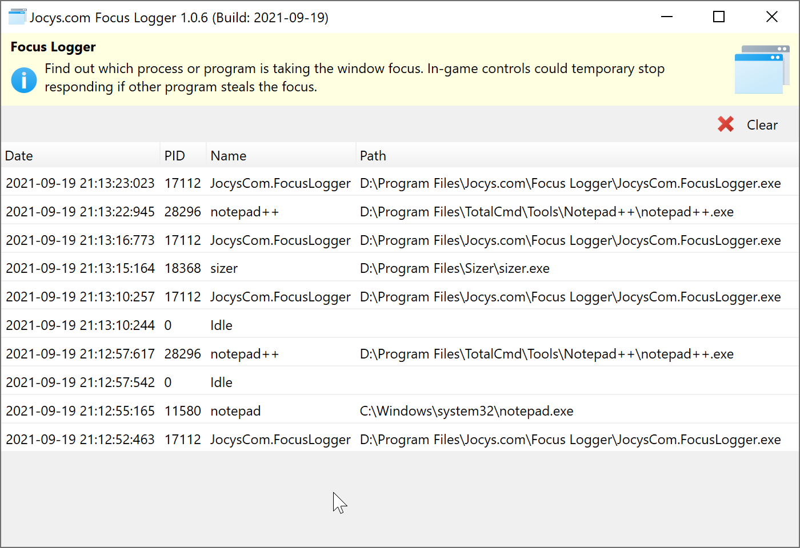

# Jocys.com Focus Logger

Find out which process or program is taking the window focus.

In game, mouse and keyboard could start temporary stop responding if other program takes the focus. This tools could help to find out which program steals the focus.

# Download

Digitally Signed Application v1.1.6.0 (2023-01-15)

[Download - JocysCom.FocusLogger.zip](https://github.com/JocysCom/FocusLogger/releases/download/1.1.0.0/JocysCom.FocusLogger.zip)

# System Requirements

- Microsoft Windows 7 SP1 or newer.

  https://github.com/dotnet/core/blob/main/release-notes/6.0/supported-os.md
- Microsoft .NET 6.0 (included with Windows Updates).

  https://dotnet.microsoft.com/en-us/download/dotnet

## Screenshots

